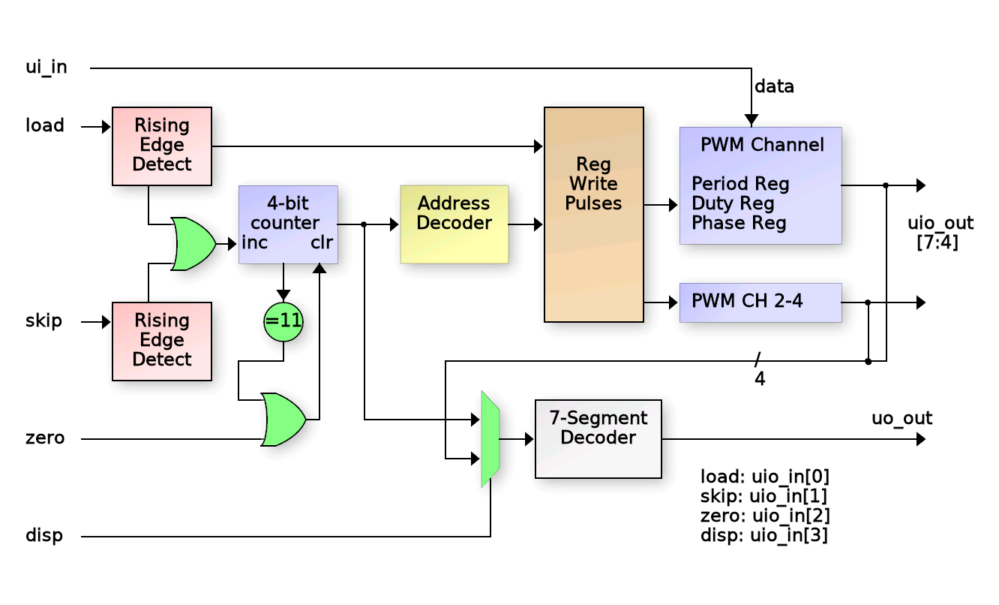

## Wokwi 4-Channel PWM

As it says, this is a 4-channel PWM coded in Wokwi.  Each channel has 3 8-bit values to control their
frequency, duty cycle and relative (starting) phase to each other.  Values are loaded by setting 8-bit data in on ui_in[7:0] and loading to the current address which auto-increments.

## Block diagram

## How it works

After reset, there is an 4-bit counter that is the address where the next 8-bit input data
at in[7:0] will be loaded.  The 'load' signal loads the 8-bit input to the register at that
current counter address and then increments the counter.

The 'skip' input will skip an address without loading it.  And the 'zero' input will reset
the counter back to zero.

None of the 'load', 'skip', 'zero' or 'disp' inputs are debounced, but they are riging edge
detected (at least the load and skip are).

The current count (register address) is displayed on the 7-segment display via a 4-to-7 decoder.
Each of 4 PWM channels use two 8-bit control registers to set frequency and duty cycle.  The first (lowest address) register
controls the duty cycle and the second (highest address) controls the period of that channel.
Only channels with non-zero period value will operate (the counter does not count when 
period_val is zero).
For PWM channels 2-4, there is an additional 8-bit register (address 8-10) to control the starting
phase of that channel relative to channel 1.  This means that if channels 2-4 are to be used, channel 1 must also be used.

Program PWM channel control registers to create independent PWMs:

Address     Meaning
0x0           PWM1 duty
0x1           PWM1 period
0x2           PWM2 duty
0x3           PWM2 period
0x4           PWM3 duty
0x5           PWM3 period
0x5           PWM4 duty
0x7           PWM4 period
0x8           PWM2 phase
0x9           PWM3 phase
0xa           PWM4 phase
0xb           Control
                BIT0:
                BIT1:
                BIT2:
                BIT3:  Write '1' to clear and synchronize all PWM channels.  Self clearing.

## How to test

1.  Start the clock and reset the circuit. 
2.  Set the DIP switches so only switch 7 is on (8'h40)
3.  Press 'load'.  The display should now show '1'.
4.  Set the DIP switches so only switch 8 is on (8'h80).
5.  Press 'load'.  The display should show '2' and the first LED should start blinking at about 50% rate.
6.  Continue programming values for the other 3 PWMs by setting DIP switch value and pressing 'load'
    even values (duty cycle) must be less that the associated odd address value (period).
7.  When the 7-segment display shows "8", this is the phase offset value for PWM channel 2 relative to channel 1.
    Loading a value here will force a known phase for channel 2 WHEN THE CHANNELS ARE SYNCHRONIZED.
8.  Load additional relative phase values for PWM channels 3 and 4 at the next two addresses (9 and A).
9.  To synchronize the PWM channels, write a value of 4 to address B.

## External hardware

LEDs should be connected to the PWM channel outputs. The 7-Segement display shows the current register address to be written.
